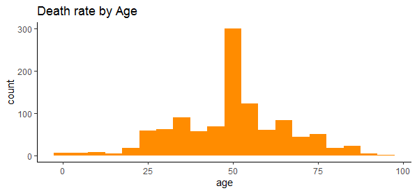
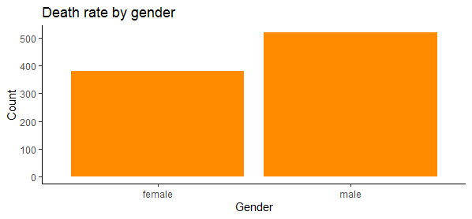

# Covid-19-Analysis

## Project Overview

Covid-19 is a virus that has affected the whole world and somehow put it on hold. We have gotten data from kaggle about the number of deaths and their recovery. This data is a bout the origin country of the virus, China from a place called Wuhan.

## Objectives

We are going to statistically test whether some claims made by the medical team are true.We will use the t-test to find out whether:

  * Males have a higher death rate than females
  
  * Elder people have a higher death rate than younger people.

## Outcome

I performed a t test on the dataset to prove the following hypothesis:

1. Death rate is higher in males than females.

With 95% confidence: men have 1.7% to 7.8% higher chance of dying compared to women.

Normally, if p-value<0.05, we reject null hypothesis (p-value=0.002).

So the statistic is significant and the claim is true.

2. Death rate is higher in older people.

With a 95% confidence the difference between a person who is alive and dead is between 14 to 24 years.

Normally, if p-value<0.05, we reject null hypothesis (p-value=0).

The statistic is significant. The claim is true.

## Data cleaning

The dataset had lots of missing values.

Those with 100% missing values we dropped while the rest we filled with their means.

Here is a plot of

## EDA

Here are some of the visualizations I made.

